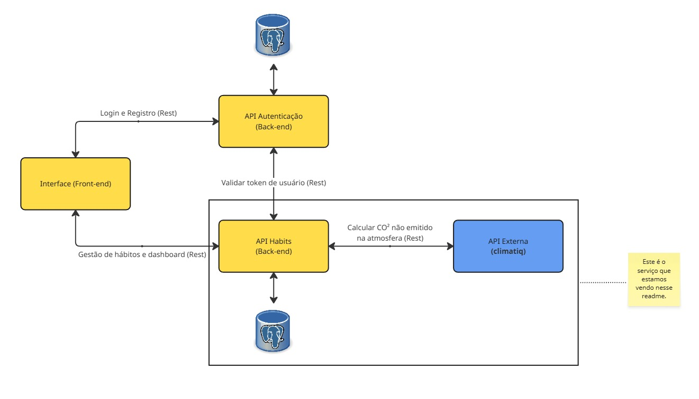

# Sistema de Gestão de Hábitos Sustentáveis - API de gestão dos hábitos e dashboard

## O que o projeto faz (Descrição)

Esta API gerencia hábitos sustentáveis dos usuários, permitindo criar, listar, atualizar e excluir hábitos relacionados à economia de energia. Com base nos hábitos criados, está API também se comunica com outra api externa chamada climatiq que calcula com base no kWh envaido quanto de CO² deixa de ser emitido na atmosfera.

### Diagrama
Cada um dos 3 projetos terá o mesmo diagrama, apenas com uma diferença que é a marcação de qual serviço ele representa.




## Pré-requisitos
- Docker e Docker Compose (opcional, para rodar com Docker)
- Aplicação Auth API

- É necessário que a API de autenticação (`api-auth`) esteja rodando para que você possa obter o token JWT via login. A documentação da `api-auth` está disponível no próprio projeto.

## Como rodar com Docker

1. Certifique-se de que a `api-auth` está rodando e configurada corretamente.
2. Configure as variáveis de ambiente necessárias (exemplo: CLIMATE_API_KEY, AUTH_SERVICE_HOST) em um arquivo `.env` ou diretamente no docker-compose.yml.
3. Execute o comando abaixo na raiz do projeto:

```
docker-compose up --build
```

>> Se ao rodar o build der erro na api, aguarde o banco subir e reinicie que irá funcionar.

O serviço estará disponível na porta definida (exemplo: 5003).

## Como testar os endpoints

Você pode testar os endpoints usando ferramentas como Postman, Insomnia ou curl. Exemplos:

- **Criar hábito:**
  ```bash
  curl -X POST http://localhost:5003/habits \
    -H "Authorization: Bearer <seu_token_jwt>" \
    -H "Content-Type: application/json" \
    -d '{"name": "Economizar energia", "frequency": "diário", "quantity": 10, "start_date": "2025-09-01", "location": 1}'
  ```
- **Listar hábitos:**
  ```bash
  curl -X GET http://localhost:5003/habits \
    -H "Authorization: Bearer <seu_token_jwt>"
  ```
- **Dashboard:**
  ```bash
  curl -X GET http://localhost:5003/habits/dashboard \
    -H "Authorization: Bearer <seu_token_jwt>"
  ```
- **Atualizar hábito (PUT):**
  ```bash
  curl -X PUT http://localhost:5003/habits/<id_habit> \
    -H "Authorization: Bearer <seu_token_jwt>" \
    -H "Content-Type: application/json" \
    -d '{"name": "Novo nome", "quantity": 20}'
  ```
- **Excluir hábito (DELETE):**
  ```bash
  curl -X DELETE http://localhost:5003/habits/<id_habit> \
    -H "Authorization: Bearer <seu_token_jwt>"
  ```
- **Buscar hábito por ID (GET):**
  ```bash
  curl -X GET http://localhost:5003/habits/<id_habit> \
    -H "Authorization: Bearer <seu_token_jwt>"
  ```

## Como funciona a integração externa

A API integra-se ao serviço Climatiq para estimar o impacto ambiental dos hábitos, como a emissão de CO₂ evitada. Para isso, utiliza a chave CLIMATE_API_KEY e faz requisições à API externa, enviando dados de energia economizada. Também valida tokens JWT via microsserviço de autenticação, garantindo segurança nas operações.

- **Climatiq:** Estimativa de emissões de carbono baseada nos dados dos hábitos.
- **Auth Service:** Validação de autenticação dos usuários via token JWT.

Para se cadastrar no climatiq acesse: https://climatiq.io/ e vá até Get Started.

Página de termos de uso: https://www.climatiq.io/terms onde fala a respeito da licença gratuita.

Rota utilizada para fazer as requisições: https://api.climatiq.io/data/v1/estimate

Exemplo de teste:
```bash
curl -X POST https://api.climatiq.io/data/v1/estimate \
  -H "Authorization: Bearer <CLIMATE_API_KEY>" \
  -H "Content-Type: application/json" \
  -d '{
    "emission_factor": {
      "activity_id": "electricity-supply_grid-source_residual_mix",
      "data_version": "^21"
    },
    "parameters": {
      "energy": <valor_energy>,
      "energy_unit": "kWh"
    }
  }'
```

Consulte o código e o docker-compose.yml para detalhes das variáveis de ambiente e configurações.

Github do projeto: https://github.com/tiagoluizrs/dev-full-stack-puc-bloco3-api-habits
